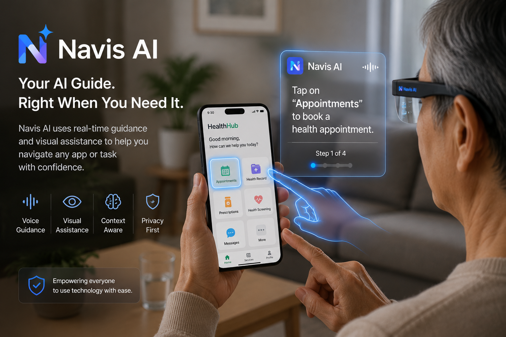

# Navis AI

# Learn by Doing.

**An AI-powered augmented reality learning platform that teaches through guided, real-world experiences.**

> Learning shouldn't begin with a manual. It should begin the moment you need help.

<p align="center">
  
</p>


---

# The Education Problem

Learning today is often disconnected from the moment people need it.

Whether navigating a new mobile application, completing a healthcare appointment, learning workplace procedures, or using unfamiliar technology, people often rely on manuals, tutorial videos, or online searches.

These resources explain **what** to do, but rarely guide users **while** they are doing it.

We believe learning should happen through experience—not instructions.

---

# Our Vision

Navis AI combines artificial intelligence with augmented reality to create an AI coach that teaches people through guided experiences.

Instead of asking users to pause and watch a tutorial, Navis AI understands their intent and surroundings, then provides real-time coaching directly within their environment.

Using augmented reality, the AI coach demonstrates exactly what to do through contextual visual guidance, gestures, animations, and natural voice or text explanations.

Rather than simply providing answers, Navis AI guides users step by step until the task is completed—turning every real-world experience into an opportunity to learn.

<p align="center">
  
</p>

> **Placeholder:** A concept illustration showing an AI coach standing beside a user, pointing and demonstrating actions through AR.

---

# Potential Applications

<table>
<tr>
<td align="center" width="50%">
<br>
<b>Digital Literacy</b><br>
Learn to navigate apps and digital services with AI-guided coaching.
</td>

<td align="center" width="50%">
<br>
<b>Workplace Training</b><br>
Receive contextual guidance while learning new procedures and equipment.
</td>
</tr>

<tr>
<td align="center">
<br>
<b>Physical Skills</b><br>
An AI coach demonstrates movements, posture, and techniques in real time.
</td>

<td align="center">
<br>
<b>Everyday Learning</b><br>
Learn everyday tasks naturally through interactive AR guidance.
</td>
</tr>
</table>

---

# Our First Step

Every platform begins by solving one meaningful problem.

Our first prototype focuses on **digital literacy** by helping users book healthcare appointments through AI-guided augmented reality.

By using a smartphone as the first platform, we can validate the core learning experience—understanding context, guiding users in real time, and enabling learning through doing.

As augmented reality hardware continues to evolve, our long-term vision is to bring this same AI coaching experience to wearable AR glasses.

<p align="center">
  
</p>

> **Placeholder:** Mock-up of the current phone prototype showing AI coaching during healthcare appointment booking.

---

# How It Works

```text
User Needs Help
        ↓
AI Understands Intent
        ↓
AI Understands Context
        ↓
AI Plans the Next Best Action
        ↓
AI Coach Demonstrates the Task
  • Visual AR guidance
  • Gestures & animations
  • Voice & text coaching
        ↓
User Completes the Step
        ↓
Learning Happens Naturally
```

---

# Roadmap

| Stage | Status |
|--------|--------|
| User Research & Validation | Completed |
| Smartphone AI Coaching Prototype | In Progress |
| Expanded Learning Applications | Planned |
| Wearable AR Glasses Experience | Long-term Vision |

---

## Project Information

| Item | Details |
|------|---------|
| Project Name | Navis AI |
| Founder | Alicia Ong |
| Institution | Nanyang Technological University |
| Programme | Computer Engineering |
| SEP Cohort | 2026 |
| Project Start Date | May 2026 |
| Current Stage | AI-guided Healthcare MVP Development |

---

## Finance & Budget

### Funding Sources

| Source | Amount (SGD) |
|-----------------------|------------|
| NTU SEP Grant | $3,000 |
| Total Funding Available | $3,000 |

### Expenditure to Date

| Item | Cost (SGD) |
|---------------------|----------|
| Claude Pro (3 Months) | $90 |
| Total Spent | $90 |

### Remaining Budget

**SGD $2,910**

### Planned Expenditure

The remaining budget will support continued MVP development, user testing, and the acquisition of wearable AR hardware for prototype development and usability evaluation.

---

## Competitions & Achievements

### 2026

* Accepted into NTU Student Entrepreneurship Programme (SEP)
* Awarded SGD $3,000 SEP Startup Grant

### Upcoming

* Hackathons
* Startup competitions
* Innovation showcases

---

## Investment & Funding

| Category | Status |
|--------------------|-----------|
| Funding Stage | Pre-Revenue |
| Total Funding Raised | SGD $3,000 |

---

## Team

### Alicia Ong

Founder & Product Lead

NTU Computer Engineering

---

## Resources

### SEP Progress Reports

* [Progress Report #1 (May 2026)](progress/report-01-may-2026.md)
* [Progress Report #2 (July 2026)](progress/report-02-jul-2026.md)

---

## Contact

For collaborations, partnerships, or feedback:

📧 [alic0034@e.ntu.edu.sg](mailto:alic0034@e.ntu.edu.sg)

Or open an issue on GitHub.
