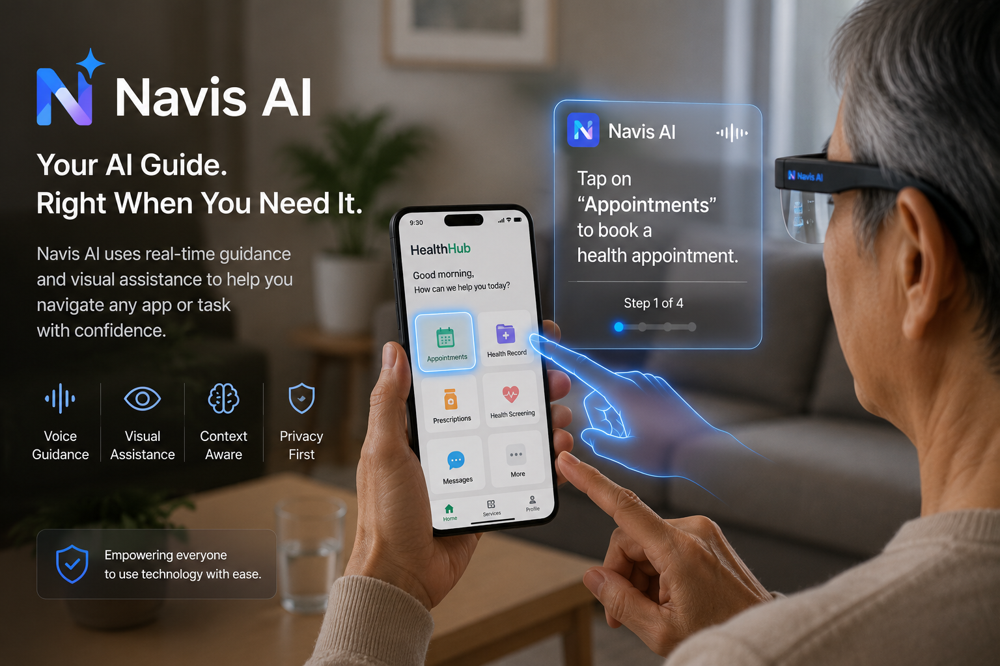

# Navis AI

## Learn by Doing.

**An AI-powered visual guidance platform that helps people understand what they're looking at and guides them through what to do next.**

> Learning shouldn't begin with a manual. It should begin the moment you need help.

<p align="center">
  
</p>

---

# The Problem

Learning often becomes disconnected from the moment people actually need help.

Whether navigating unfamiliar technology, learning workplace procedures, understanding a scientific diagram, or completing an unfamiliar task, people often have to stop what they are doing to search through manuals, tutorials, videos, or online explanations.

These resources can explain **what** to do.

But they rarely guide people **while they are doing it**.

Navis AI explores a different approach:

> **What if AI could understand what you're looking at and guide you directly through it?**

---

# Our Vision

Navis AI is building an AI coach that understands what you are looking at, understands what you want help with, and guides you visually.

Instead of simply providing an answer or a set of instructions, Navis AI aims to show users **where to look and what to do next**.

The core interaction is:

**SEE → ASK → GUIDE**

A user points their camera at something, asks a natural-language question, and receives contextual visual guidance.

Over time, this guidance can become increasingly interactive — helping users understand unfamiliar environments, learn new skills, and complete tasks step by step.

Our long-term vision is to combine:

**AI Vision + Natural Language + Augmented Reality**

to create an AI coach that can guide people through real-world experiences.

<p align="center">
  
</p>

> **Concept:** Navis AI providing contextual visual guidance in a real-world environment.

---

# Current Prototype

We have developed our first working smartphone-based visual guidance prototype.

The prototype demonstrates a simple interaction:

**SEE → ASK → POINT**

Users point their smartphone camera at something they want to understand and ask a natural-language question.

For example:

> **"Where is the C=C double bond?"**

Navis AI uses computer vision to identify the requested visual element and determine where it appears in the camera view.

An AR-style pointer then guides the user directly to the relevant location.

Instead of simply answering:

> "The C=C double bond is between these two carbon atoms."

Navis aims to show:

> **"It's right here."**

<p align="center">
  
</p>

### The Current Experience

```text
SMARTPHONE CAMERA
        ↓
      SEE
        ↓
  ASK A QUESTION
        ↓
   AI VISION
        ↓
IDENTIFY VISUAL TARGET
        ↓
   POINT / GUIDE
```

The chemistry example is a demonstration of the underlying technology — not the final product.

---

# What We've Built

The current prototype includes:

* Smartphone camera interaction
* Natural-language questions
* AI vision analysis
* Visual target detection
* Coordinate-based target identification
* AR-style visual pointer
* Contextual explanations
* Voice input and spoken responses
* Mobile-oriented interface

### Prototype Stack

```text
React + Vite
      ↓
   FastAPI
      ↓
 Gemini Vision
      ↓
Visual Target + Coordinates
      ↓
 AR-style Pointer
```

The current prototype is intentionally lightweight so that we can quickly test the core experience with real users.

---

# Potential Applications

The underlying technology is designed to work beyond a single subject or use case.

<table>
<tr>
<td align="center" width="50%">
<br>

<b>Digital Literacy</b><br>

Learn to navigate unfamiliar apps and digital services with AI-guided coaching.

</td>

<td align="center" width="50%">
<br>

<b>Workplace Training</b><br>

Receive contextual guidance while learning new procedures, equipment, and workflows.

</td>
</tr>

<tr>
<td align="center">
<br>

<b>Physical Skills</b><br>

Explore AI-guided learning for movements, techniques, and hands-on skills.

</td>

<td align="center">
<br>

<b>Everyday Learning</b><br>

Get visual guidance when encountering unfamiliar objects, tasks, and environments.

</td>
</tr>
</table>

Other potential applications include:

* Mathematics
* Chemistry and science
* Electronics and circuit diagrams
* Software interfaces
* Technical training
* Healthcare and digital services
* Workplace procedures
* Everyday unfamiliar tasks

---

# From Prototype to Product

Our first prototype demonstrates that AI can identify a visual target and guide a user toward it.

The next step is to understand **where this interaction creates the most value**.

Rather than immediately building a full native or wearable application, we are focusing first on getting the experience into the hands of early users.

### Next Phase

```text
WORKING PROTOTYPE
        ↓
    WEB MVP
        ↓
    EARLY USERS
        ↓
   USER FEEDBACK
        ↓
   VALIDATE USE CASES
        ↓
     WAITLIST
        ↓
  FULL APPLICATION
```

The web application will allow us to test the product with real users while building an early community around Navis AI.

The eventual goal is to expand from a smartphone experience toward richer interactive guidance and, eventually, wearable AR.

---

# Roadmap

| Stage                                | Status           |
| ------------------------------------ | ---------------- |
| User Research & Initial Validation   | Completed        |
| Visual Guidance Concept              | Completed        |
| Smartphone Visual Guidance Prototype | Completed        |
| Public Web MVP                       | Next             |
| Early User Testing                   | Next             |
| Waitlist & Product Validation        | Next             |
| Expanded Learning Applications       | Planned          |
| Interactive Step-by-Step Guidance    | Planned          |
| Wearable AR Experience               | Long-term Vision |

---

# Our Progress

### Previous Direction

Navis AI originally explored AI-guided application navigation and voice assistance.

User testing showed that people valued AI guidance, but also cared about trust, transparency, confidence, and understanding what the AI was doing.

This led us to broaden the product from:

**AI TASK ASSISTANCE**

toward:

**AI VISUAL LEARNING & GUIDANCE**

The goal is not simply to have AI complete tasks for people.

It is to help people **understand what they are doing and become capable of doing it themselves.**

---

# About

Navis AI is an independent project founded by **Alicia Ong** during the **NTU Student Entrepreneurship Programme (SEP)**.

Alicia is a Computer Engineering student at Nanyang Technological University interested in AI, human-computer interaction, and building technology that helps people learn through experience.

Navis AI is currently focused on validating its smartphone-based visual guidance experience before expanding into broader applications and, eventually, wearable AR.

---

# Funding & Budget

### Funding

| Source                                       | Amount (SGD) |
| -------------------------------------------- | -----------: |
| NTU Student Entrepreneurship Programme Grant |       $3,000 |
| **Total Funding Available**                  |   **$3,000** |

### Expenditure to Date

| Item            | Cost (SGD) |
| --------------- | ---------: |
| Claude Pro      |       $150 |
| **Total Spent** |   **$150** |

### Remaining Budget

**SGD $2,850**

### Planned Expenditure

The remaining funding will support:

* Gemini API usage
* AI and MVP development
* Web application deployment and software tools
* Marketing and early user acquisition
* User testing and product validation
* Prototype development
* Future AR/VR experimentation where relevant

The immediate focus is to move from a working prototype toward a publicly accessible web MVP, early users, and a waitlist for the future Navis AI application.

---

# Programme & Achievements

### 2026

* Accepted into the **NTU Student Entrepreneurship Programme (SEP)**
* Awarded **SGD $3,000 SEP Grant**
* Developed the first working Navis AI visual guidance prototype

---

# Funding Stage

| Category            | Status                   |
| ------------------- | ------------------------ |
| Stage               | Pre-Revenue              |
| External Investment | None                     |
| Programme Funding   | SGD $3,000 NTU SEP Grant |

---

# Team

## Alicia Ong

**Founder**

Computer Engineering
Nanyang Technological University

Building Navis AI around the idea that technology should help people learn by doing — not simply give them the answer.

---

# Resources

## SEP Progress Reports

* [Progress Report #1 — May 2026](progress/report-01-may-2026.md)
* [Progress Report #2 — July 2026](progress/report-02-jul-2026.md)
* [Progress Report #3 — September 2026](progress/report-03-sept-2026.md)

---

# Join the Journey

Navis AI is currently in active development.

We have built the first working prototype and are now moving toward **real-world product validation**.

The next milestone is to put the web experience in front of early users, learn where visual AI guidance creates the most value, and build a community around the future Navis AI application.

We're building toward a future where learning happens naturally, in the exact moment people need help.

**Learn by Doing.**

For collaboration, feedback, or enquiries:

**[alic0034@e.ntu.edu.sg](mailto:alic0034@e.ntu.edu.sg)**
